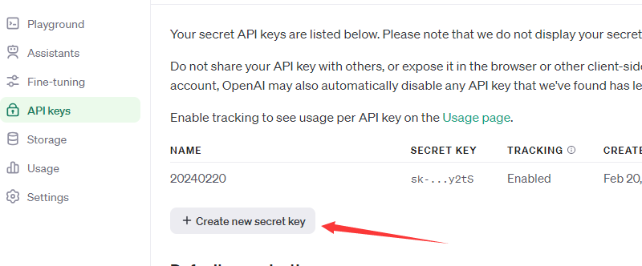
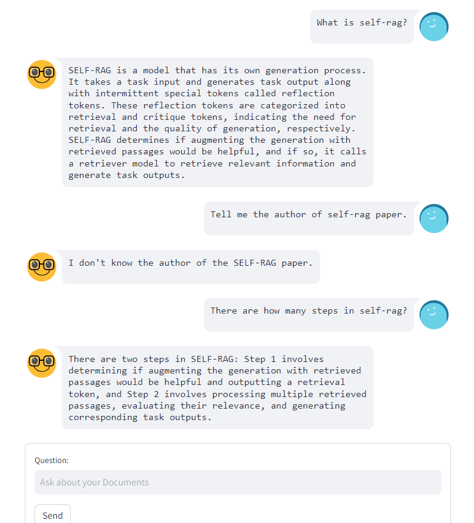
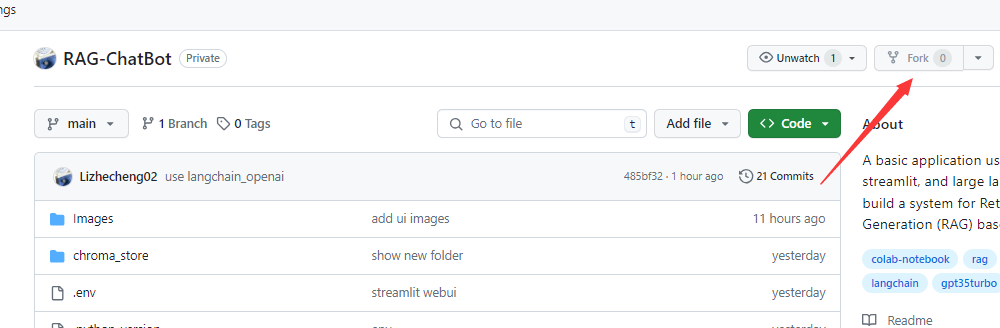

# This Repo is for creating RAG system using LangChain and Streamlit

## Python Environment

### 1. Install Packages

```b
pip install -r requirements.txt
```

### 2. Set Api Key

- Create a new ``openai api key``, link: https://platform.openai.com/api-keys.



- Copy it into .env file

​	Set ``OPENAI_API_KEY="Your API KEY"``

### 3. Run Simple Version On Colab (only support one pdf file)
- Import ``colab.ipynb`` into ``Google Colab``.

- Drag your pdf file into ``Google Colab`` and change the file name in the code.
```
loader = PyPDFLoader("data.pdf")
```

- Input your ``openai api key`` in the ``ChatOpenAI()``.

```
llm = ChatOpenAI(model_name="gpt-3.5-turbo", openai_api_key="")
```

- You can change embedding model by searching on ``HuggingFace``.
```
embedding = HuggingFaceEmbeddings(model_name="sentence-transformers/xxxxxxx")
```

- Ask question and get answer on ``Google Colab``.

	

### 4. Run Streamlit On Colab
- Import ``localtunnel.ipynb`` into ``Google Colab``.


- Input your ``openai api key`` in the ``ChatOpenAI()``.
```
llm = ChatOpenAI(
    model_name="gpt-3.5-turbo",
    temperature=0.1,
    openai_api_key=""
)
```

- You can change embedding model by searching on ``HuggingFace``.
```
embedding = HuggingFaceEmbeddings(
    model_name="sentence-transformers/xxxxxxx",
    model_kwargs={"device": "cpu"}
)
```

- You can get three urls, but you **don't need to** click any of them, stop this cell.


- Run the next cell, get the ``tunnel password``.


- Run the above cell again, you can see three urls. Click the **last url** and you will see the web page below.


- Enter the ``tunnel password``, which you got in the previous step. Then you can see the ``Streamlit WebUI``.


### 5. Run Streamlit On Local Computer

```
streamlit run app.py
```

After running this command, you can see the WebUI as the image above. On the **left side**, you can choose "Browse files" to upload multiple files as long as they are pdf, doc or txt format. If you encounter the error **AxiosError: Request failed with status code 403** while uploading the file. Try the command below.

```
streamlit run app.py --server.enableXsrfProtection false
```

Then you should be able to upload files successfully, like the image below.


You need to wait for some time to let the embedding model convert all files into high dimensional vectors and store them into a database. You will see a new folder in your local computer.


Then you can see the original chat interface like this.


Feel free to enter your question and click **Send** to chat with the ``RAG system``, you may need to wait for about 15 seconds after sending your new query. 



### 6. Compare RAG With Original ChatGPT
```
python compare.py
```
The code is almost the same as ``colab.ipynb``, just add the response from ``original ChatGPT``. When you enter the question, you can see responses from both ``RAG system`` and ``original ChatGPT``.

### 7. Deploy Your App
- Fork this GitHub repo into your own GitHub account



- Set your ``OPENAI_API_KEY`` in the ``.env`` file. (You need to clone the repo to local computer, change the file and commit it, or maybe you can delete this file and upload an another ``.env`` file)


- Go to https://share.streamlit.io/ and login with your GitHub account.
- Click **New app**.


- Enter your ``GitHub Repo Url`` in **Repository** and change the **Main file path** to ``app.py``


- Click **Deploy!**, wait for installing all packages in the ``requirements.txt``, you can see the progress.


- After it's done, you can use it.


- Now, you can share your app link with others. When you go back to https://share.streamlit.io/, you can see your application now.


### 8. Use Groq For Faster Inference

- Get your ``GROQ_API_KEY`` at https://console.groq.com/keys.

- Set your ``GROQ_API_KEY`` in the ``.env`` file.

- Follow all the steps in the **Part 7**, but change the **Main file path** to ``app-groq.py``

### 9. Use Llama Model

- Get your ``LLAMA_API_KEY`` at https://console.llama-api.com/account/api-token.

- Set your ``LLAMA_API_KEY`` in the ``.env`` file.

- Follow all the steps in the **Part 7**, but change the **Main file path** to ``app-llama.py``

### 10. Warning

Since others will be using your ``OPENAI_API_KEY``, ``GROQ_API_KEY`` and ``LLAMA_API_KEY`` when you share your app with them, all costs will be charged to your account. Be cautious when sharing it, and if needed, promptly delete the application you've deployed.

